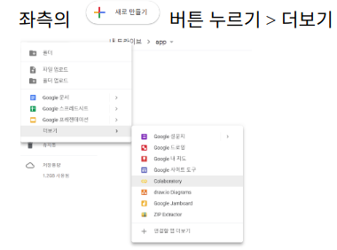
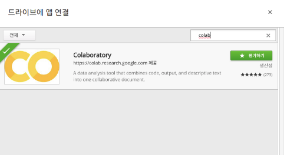
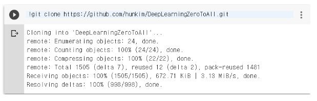
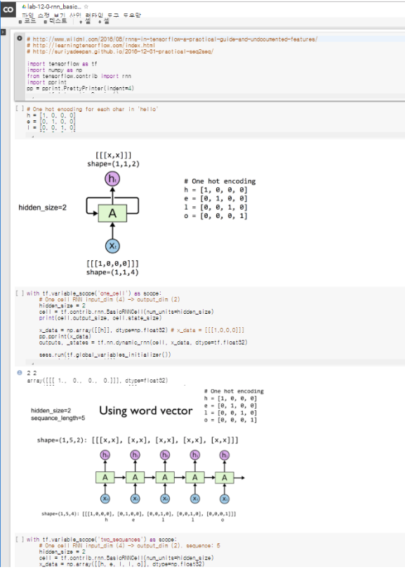
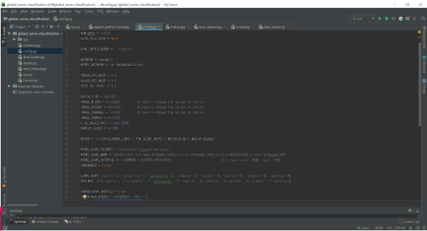
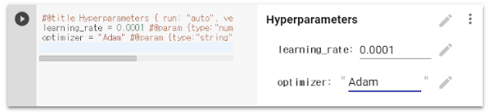
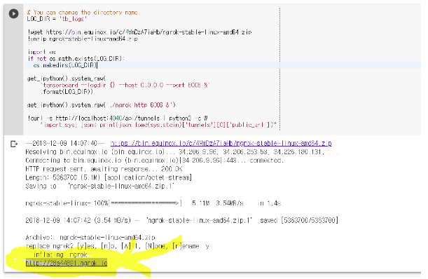
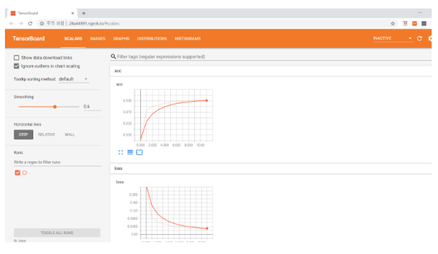
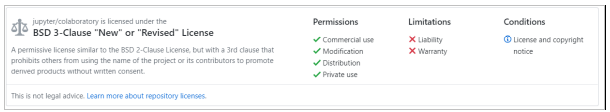
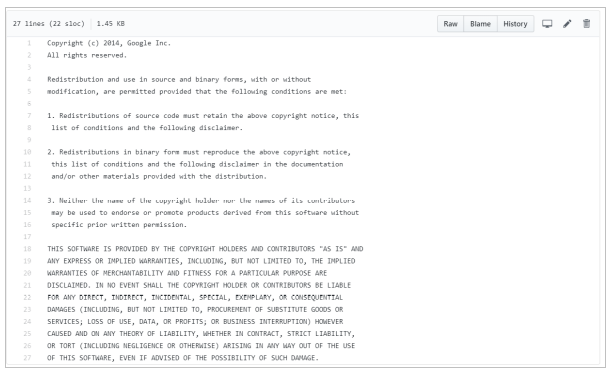

# Colaboratory

## 문서작업 블로그 (tistory)
[Colaboratory_한국어_설명_tistory](http://jisoo-coding.tistory.com/2)

* 본 readme에 요약을 해놓았지만, 자세한 내용은 위 링크에서 볼 수 있다.

## 1. 프로젝트에 대한 전반적 설명

### 1.1 서론
오늘날 학생들은 머신 러닝, 딥 러닝과 같은 AI 분야의 공부를 많이 하고 있다. 해당 학문의 특성상 많은 데이터와 학습량을 요구하기 때문에 CPU를 사용하는 것은 비효율적이다. 사실상 불가능하다고도 할 수 있다. 이처럼 높은 수준의 성능이 필요한 데이터 집약적인 응용프로그램들은 병렬처리 가속화를 위해 일반적으로 GPU를 사용한다. 하지만, 본인과 같은 학생들, 특히 입문하는 학생들에게 GPU를 구매하는 것은 부담스러운 부분이다. 이에 본 프로젝트에서는 가상으로 GPU를 무료 제공해주는 Google Colaboratory에 대해 조사하였다.

### 1.2 Google Colaboratory란?
Google Colaboratory는 텍스트, 코드, 코드 출력을 하나의 공동작업 문서로 통합해 주는 머신러닝 교육과 연구를 위한 데이터 분석 도구이다. Google Drive 상에서 동작되는 Jupyter Notebook이라고도 할 수 있다. 구글 계정이 있다면 누구나 무료로 사용할 수 있고, Jupyter Notebook 환경이다보니 설치 없이 사용할 수 있다는 장점이 있다. 그 중 가장 큰 장점은 컴퓨터에 프로그램을 다운로드나 설치를 하지 않고도 다른 사용자와 공유할 수 있다는 점이다. 현재 Colaboratory에서 지원 가능한 언어는 Python이다. Python2.7과 Python3.6 모두 지원한다. 실행된 코드는 본인의 구글 계정 전용의 가상 머신에서 실행되고 Google Drive와 연동하여 저장소도 사용할 수 있다. 그리고 웹 브라우저 환경에서 도커로 구글 서버에 접속하여 작업을 할 수 있도록 개발된 서비스이기 때문에 대부분의 브라우저와 호환된다. 하지만, 데스크톱 버전의 Chrome, Firefox에 최적화 되어있다.

### 1.3 환경 설정

* Google Drive 상에서 새로만들기 버튼을 눌러 '연결할 앱 더보기'를 누르면 창이 뜹니다.

* 그때, colab을 검색하여 Colaboratory를 찾아 연결시키면 됩니다!

### 1.3 기능 설명

#### 1.3.1 github repository 불러오기

* github의 repository 내용을 Google Drive에 clone하여 직접 실행할 수 있습니다.

#### 1.3.2 Form으로 변수 일괄 관리

* 여러 번 사용되는 변수들을 Form에 추가하여 가시적으로 쉽게 관리할 수 있습니다.

#### 1.3.3 Tensorboard 사용 가능

* 텐서보드를 호출하는 명령어를 입력하면, 링크가 생성됩니다. 그 링크에 접속하면 코드에 대한 결과를 시각화하여 볼 수 있습니다.

#### 1.3.4 Keras, PyTorch, MxNet, OpenCV 등의 라이브러리를 쉽게 설치 가능

## 2. 유사 오픈소스 프로젝트

기존 프로젝트는 다음과 같은 아래의 항목과 같은 문제점을 가지고 있다.
*  핵심적인 부분만 언급되어 있다.
*  error에 대한 해결방안은 제공되지 않는 경우가 있다
*  두서없이 적혀 있다

## 3. SW 개발자를 위한 도움
### 3.1 SW 개발자에게 도움이 되는 Source code / code sample

~~~python

// You can change the directory name

LOG_DIR = 'tb_logs'

!wget https://bin.equinox.io/c/4VmDzA7iaHb/ngrok-stable-linux-amd64.zip
!unzip ngrok-stable-linux-amd64.zip

import os
if not os.path.exists(LOG_DIR):
  os.makedirs(LOG_DIR)
  
get_ipython().system_raw(
    'tensorboard --logdir {} --host 0.0.0.0 --port 6006 &'
    .format(LOG_DIR))

get_ipython().system_raw('./ngrok http 6006 &')

!curl -s http://localhost:4040/api/tunnels | python3 -c \
    "import sys, json; print(json.load(sys.stdin)['tunnels'][0]['public_url'])"

~~~

* 본 코드를 실행해 얻어지 url을 통해 사용자가 작성한 코드에서 TensorBoard를 사용하면 해당  URL에서 확인할 수 있다.

### 3.2 기존 오픈소스 프로젝트에 비하여 개선된 사항
 기존 오픈소스는 영어로 작성된 문서이다. 이를 한글로 번역 및 정리를 하여 쉽게 프로그램을 사용할 수 있도록 제안하였다.

### 3.3 기존 오픈소스 프로젝트의 이슈 및 해결(제안)
* 기존 프로젝트들은 기본적으로 두 가지의 문제점이 있다. 핵심적인 내용만 적혀 있거나, 사용하면서 생길 수 있는 문제에 대해 해결 방법을 제시해 주지 않는다. 
* 이를 위해 본 프로젝트에서는 모든 내용을 아우르는 요소들을 파악하고 직접 하나씩 테스트 해보았다. 테스트 과정을 통해 추가적으로 발생하였던 오류와 드라이브 구조를 파악할 수 있었다
* 또, 입문자들이 아닌 딥러닝을 공부하는 학생들을 위해 사용할 수 있는 기능들을 자세하게 설명했다.

### 3.4 관련되거나 사용한 오픈소스에 대한 survey(비교자료)
보통 GPU를 사용하기 위해서는 CUDA를 설치하여 병렬 컴퓨팅을 한다. CUDA란 NVIDIA에서 개발한 병렬 컴퓨팅을 위한 프로그래밍 모델이다. 병렬 알고리즘을 간단하게 구현할 수 있도록 C/C++과 같은 고급 프로그래밍 언어로 개발 추상화를 제공하고, heterogeneous하게 CPU와 GPU를 모두 사용하는 응용 프로그램이다. 응용 프로그램의 연속적인 부분은 CPU에서 실행되고 병렬을 요구하는 부분은 GPU에서 실행되다보니, 메모리 자원의 분쟁 없이 동시 컴퓨팅할 수 있다는 장점이 있다. 하지만, 이것은 GPU를 가지고 있어야 하고, C/C++ 언어를 이용하여 버퍼를 각 할당하여 병렬 컴퓨팅을 할 수 있어야 한다는 전제가 있다. 입문자들이 이러한 low-level까지 이해하기란 버겁다. 그에 비해, Colaboratory는 GPU의 다른 설정 필요 없이 제공해주기 때문에 쉽게 사용할 수 있다. GPU의 구매 또한 필요없다.

### 3.5 관련되거나 사용한 오픈소스에 대한 사용법 설명
#### 3.5.1 CUDA
* 이미지 프로세싱부터 딥 러닝, 바이오인포매틱스, 컴퓨팅 재정학, 데이터 사이언스 등등 광범위한 영역의 응용프로그램을 가속화 하는 툴이다.
* CUDA 설치
CUDA 환경에서 지원하는 GPU가 하나 이상 있다면, Linux나 Mac 또는 Windows 시스템에 무료로 설치할 수 있다.
* CUDA 프로그램
아래 사이트를 들어가면 NVIDIA에서 직접 제공하는 예제를 영상을 보고 따라할 수 있다. [영상링크](https://www.youtube.com/playlist?list=PL5B692fm6--vScfBaxgY89IRWFzDt0Khm)
CUDA 설명서의 프로그래밍 가이드에는 CUDA 프로그래밍 모델, 중요한 API 및 성능 지침 등 동영상에서 다루는 주요 개념이 소개되어 있다. 또한 NVIDIA는 Self-Paced Lab 컬렉션을 통해 핸즈온 트레이닝을 제공한다. 그로인해 해당 Lab에서는 코드 편집과 실행을 단계별로 안내하고, 시각화를 위한 툴과의 상호작용까지 통합할 수 있다.

#### 3.5.2 SDAccel
Xilinx사에서 제공하는 툴로 FPGA상의 다른 응용 프로그램을 가속화하는 프로세스를 용이하게 해준다. SDAccel을 설치하면, 공식 문서에 따라 기본 예제를 설치할 수 있다. 예제로는 손글씨 인식, edge detection 등이 있다.

### 3.6 기타 오픈소스를 사용하고자 하는 SW 개발자에 도움이 되는 것
#### 3.6.1 GPU사용
CPU를 사용하여 딥러닝 네트워크를 학습하다 보면 memory의 문제나 학습시간의 문제가 발생한다. 하지만 이 문서를 통해 개발자가 GPU와 TPU를 쉽게 사용할 수 있다. 또한 무료로 제공되기 때문에 가격 부담을 줄일 수 있다.
#### 3.6.2 쉬운 피드백을 통한 오류 처리
본 프로젝트를 통해 제공하는 문서는 다른 SW개발자들이 사용할 수 있게 [tistory](http://jisoo-coding.tistory.com/2) 에 문서화여 게시하였다. 이를 통해 큰 프로젝트를 진행하고자 하는 개발자들이 쉽게 접근 가능하여 어렵지 않게 사용할 수 있다. 또한 개인 블로그에 게시한만큼 본 문서를 사용하는 개발자들이 사용 중 문제나 질문이 생기면 쉽게 소통할 수 있어 바로바로 피드백이 가능하다. 

## 4. 사용한 오픈소스 라이센스와 본 프로젝트의 라이센스

## Future Work
* 입문자들이 사용해볼 수 있는 예제 코드를 추가할 것이다.
* 더 많은 데이터로 돌려볼 수 있는 예제를 추가할 것이다.

## 참고 문헌

[Medium_기술_블로그](https://medium.com/deep-learning-turkey/google-colab-free-gpu-tutorial-e113627b9f5d)

## License
[colaboratory_license](https://github.com/jupyter/colaboratory/blob/master/LICENSE)

Copyright (c) 2014, Google Inc.
All rights reserved.

Redistribution and use in source and binary forms, with or without
modification, are permitted provided that the following conditions are met:

1. Redistributions of source code must retain the above copyright notice, this
 list of conditions and the following disclaimer.

2. Redistributions in binary form must reproduce the above copyright notice,
 this list of conditions and the following disclaimer in the documentation
 and/or other materials provided with the distribution.

3. Neither the name of the copyright holder nor the names of its contributors
 may be used to endorse or promote products derived from this software without
 specific prior written permission.

THIS SOFTWARE IS PROVIDED BY THE COPYRIGHT HOLDERS AND CONTRIBUTORS "AS IS" AND
ANY EXPRESS OR IMPLIED WARRANTIES, INCLUDING, BUT NOT LIMITED TO, THE IMPLIED
WARRANTIES OF MERCHANTABILITY AND FITNESS FOR A PARTICULAR PURPOSE ARE
DISCLAIMED. IN NO EVENT SHALL THE COPYRIGHT HOLDER OR CONTRIBUTORS BE LIABLE
FOR ANY DIRECT, INDIRECT, INCIDENTAL, SPECIAL, EXEMPLARY, OR CONSEQUENTIAL
DAMAGES (INCLUDING, BUT NOT LIMITED TO, PROCUREMENT OF SUBSTITUTE GOODS OR
SERVICES; LOSS OF USE, DATA, OR PROFITS; OR BUSINESS INTERRUPTION) HOWEVER
CAUSED AND ON ANY THEORY OF LIABILITY, WHETHER IN CONTRACT, STRICT LIABILITY,
OR TORT (INCLUDING NEGLIGENCE OR OTHERWISE) ARISING IN ANY WAY OUT OF THE USE
OF THIS SOFTWARE, EVEN IF ADVISED OF THE POSSIBILITY OF SUCH DAMAGE.
